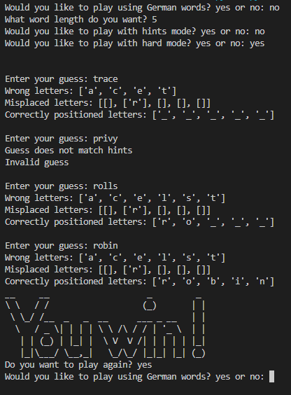

# wordle-project

## Build project
```
git pull https://github.com/EpicPenguino/wordle-project
```

## Description
This will set some variables for the hints, the actual word, and a list of the possible words.
There is an option for german mode, pickable word length, easy mode (provides list of potential answers), and hard mode (restricts guesses to having to match provided hints).
The user will be continousuly prompted through the command line for a valid guess in the dictionary and of the correct length, and it will tell whether a letter is wrong, misplaced, or correct, like the actual Wordle.
After winning, there is also an option to play again.

## Example
